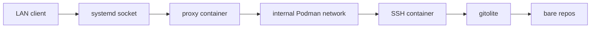
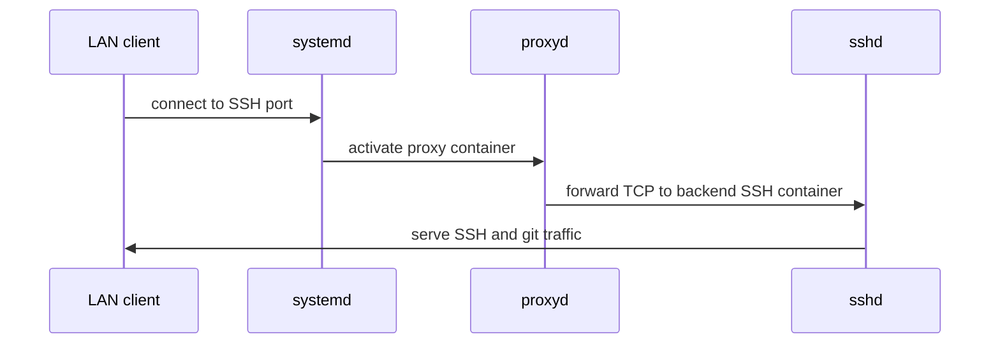

# WSL Git Server Container

Git server running in a WSL container, with Principal of Least Privilege in mind.

## Details

- Internal Podman network
    - Restricts uninitiated outbound network / internet access
    - `systemd-socket-proxyd` container provides socket activation support for the sshd container
- Dedicated `git` user
    - Runs under a dedicated Linux `git` user instead of the personal WSL account.
- Per client SSH keys
    - Uses `gitolite` so repo permissions can be granted per client SSH key.
- Replayable install scripts

## Systemd Socket Activation

Systemd opens the listening socket on the host. Podman passes that socket into the proxy container, and `systemd-socket-proxyd` forwards the TCP stream to the backend SSH container on the internal Podman network.

## Installation

- Run the scripts in order
- To add/remove users, see: [basic administration - Gitolite](https://gitolite.com/gitolite/basic-admin.html)

## References

Big thanks to [Erik Sjölund](https://github.com/eriksjolund) for the detailed documentation and demos on using Podman with systemd socket activation.

- [Git - Getting Git on a Server](https://git-scm.com/book/en/v2/Git-on-the-Server-Getting-Git-on-a-Server)
- [podman-caddy-socket-activation/examples/example2](https://github.com/eriksjolund/podman-caddy-socket-activation/blob/main/examples/example2/README.md)
    - [How to limit container privilege with socket activation](https://www.redhat.com/en/blog/socket-activation-podman)
    - [How to restrict network access in Podman with systemd](https://www.redhat.com/en/blog/podman-systemd-limit-access)
    - [Demo: run Caddy with socket activation + rootless Podman + Quadlet files](https://caddy.community/t/demo-run-caddy-with-socket-activation-rootless-podman-quadlet-files/25918)
- [podman/docs/tutorials/socket_activation.md](https://github.com/containers/podman/blob/main/docs/tutorials/socket_activation.md)
- [podman-networking-docs](https://github.com/eriksjolund/podman-networking-docs/blob/main/README.md)
- [podman-systemd.unit](https://docs.podman.io/en/latest/markdown/podman-systemd.unit.5.html)
- [systemd.unit # Specifiers](https://www.freedesktop.org/software/systemd/man/latest/systemd.unit.html#Specifiers)

## Disclaimer

This project is intended for educational purposes. It is not intended for production use, and may have security implications if used in a real environment. Use at your own risk.

Please report any issues or suggestions for improvement.